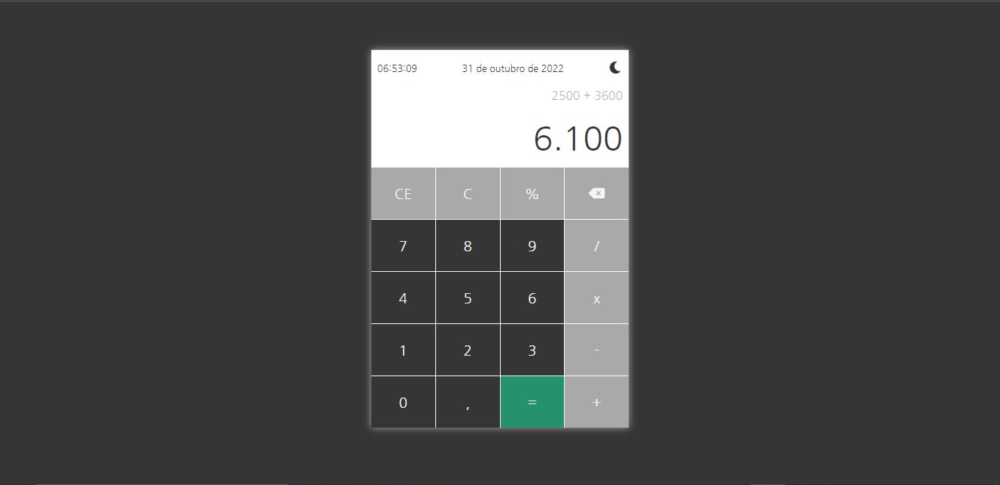
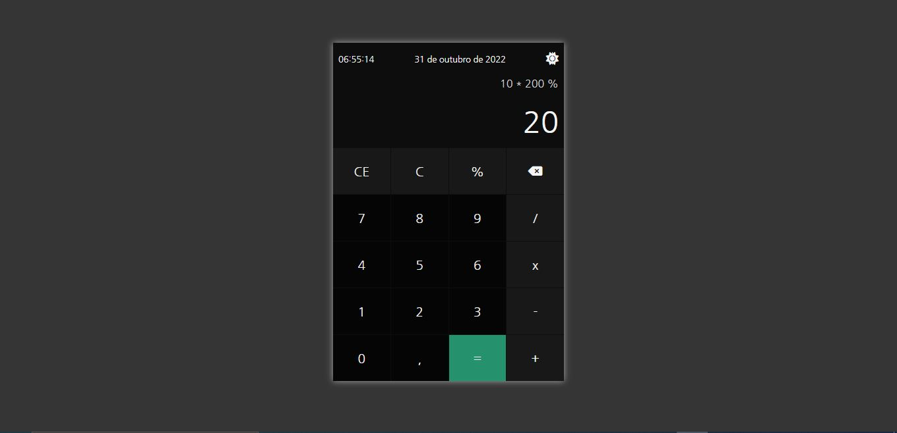

# Calculator

## Uma calculadora baseada no layout e comportamentos da calculadora do windows.

### Comportamentos:

1. Apertar a tecla igual mais de uma vez ao apresentar o resultado.

    *Será mostrado o calculo baseado no último número inserido.*
    
2. Apertar a tecla igual mais de uma vez após apertar pela segunda vez um operador.

    *Será mostrado o calculo baseado no próprio resultado.*

3. Clipboard - Opção de copiar e colar valores na calculadora usando **ctrl+c** e **ctrl+v**.
    
    *Pode copiar um valor de qualquer outro lugar e colar na calculadora.*

    *Pode copiar o valor da calculadora e colar em qualquer outro lugar.*

4. Histórico da operação

5. Dark theme

---

## Telas

 

 

---

## Vídeo

https://user-images.githubusercontent.com/59326026/198992407-a1c79f53-40f3-41d2-81a0-aed54e92090d.mp4

---

## Link aplicação

https://calculator-e.netlify.app/
